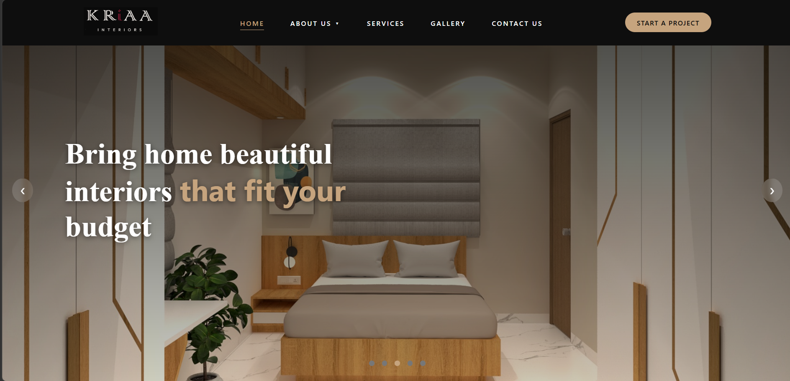
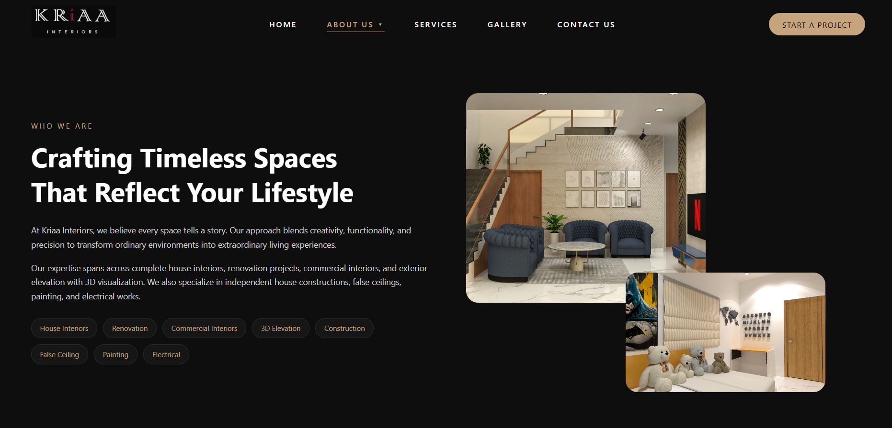
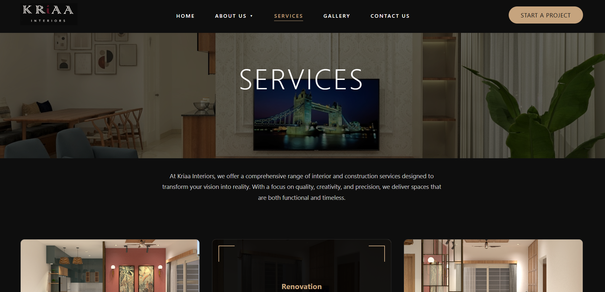
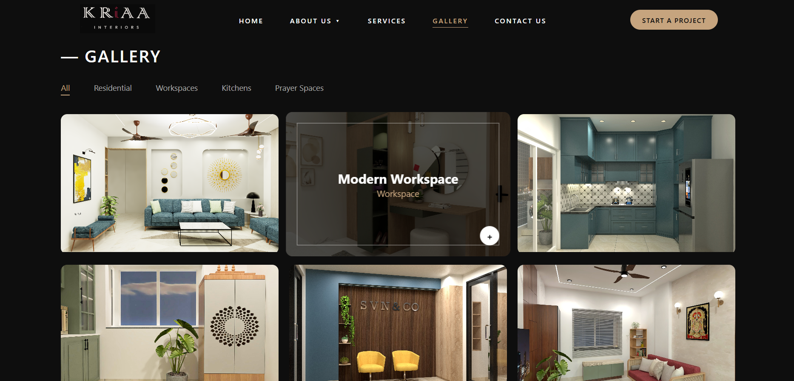
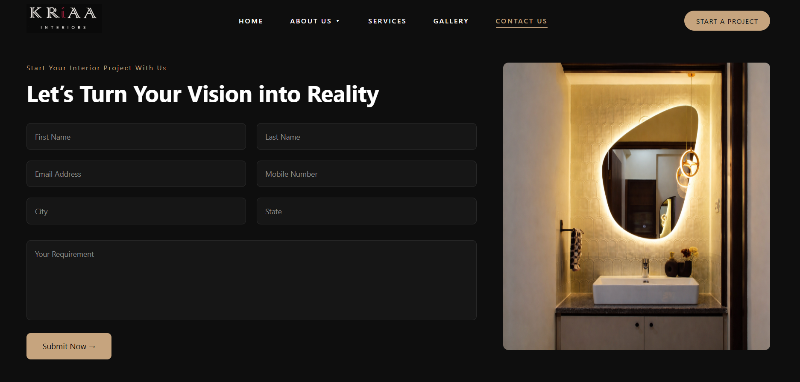

# Kriaa Interiors Website

A responsive interior design website created for Kriaa Interiors, showcasing interior design services, projects, team information, galleries, and contact functionality.

## Features

* Responsive website layout
* Home page with hero sections
* About Us section
* Interior design services
* Project/gallery showcase
* Our Team section
* Contact form
* Email functionality using PHPMailer
* Reusable PHP header and footer components
* Custom images and branding

## Technologies Used

* HTML5
* CSS3
* PHP
* PHPMailer

## Project Structure

```text
kriaa-interiors-website/
│
├── css/
│   ├── about.css
│   ├── contactus.css
│   ├── footer.css
│   ├── gallery.css
│   ├── header.css
│   ├── index.css
│   ├── our_team.css
│   └── services.css
│
├── images/
│   └── Website images and assets
│
├── php/
│   ├── about.php
│   ├── contactus.php
│   ├── footer.php
│   ├── gallery.php
│   ├── header.php
│   ├── index.php
│   ├── our_team.php
│   ├── sendmail.php
│   └── services.php
│
├── PHPMailer-master/
│   └── PHPMailer library
│
└── README.md
```

## Email Configuration

The contact form uses PHPMailer with Gmail SMTP.

Before using the email functionality, configure your own SMTP email address and app password in `php/sendmail.php`.

**Do not commit real passwords, app passwords, API keys, or other credentials to the repository.**

## Website Preview

Screenshots can be added here to showcase the website's main sections.

## Purpose

This project was developed as an interior design website to showcase Kriaa Interiors' services, completed projects, team, and contact information through a responsive web interface.

## Author

Harshini
## Website Preview

### Homepage



### About Us



### Services



### Gallery



### Contact


